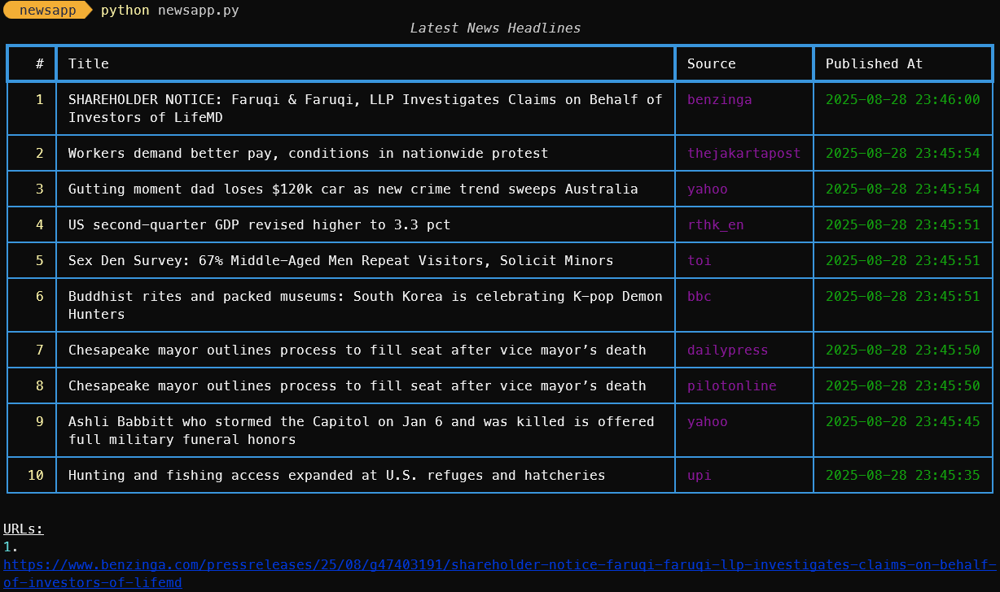
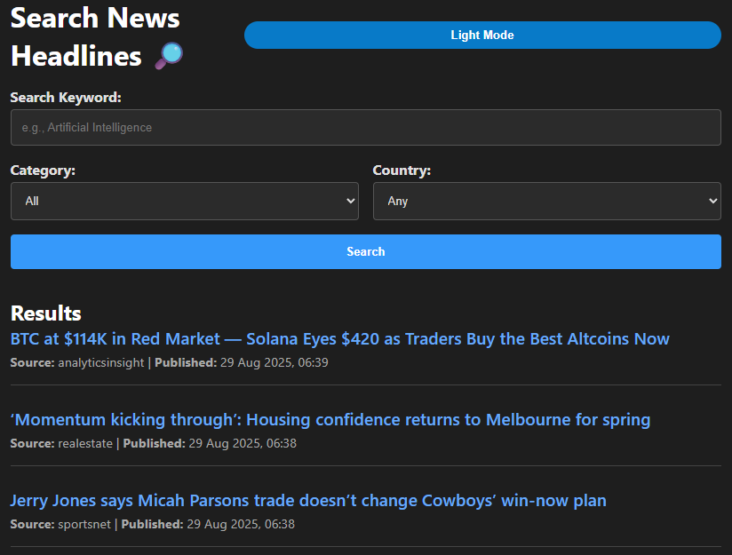

# News Headlines App with NewsData.io API

This is a Python application that fetches and displays the latest news headlines from the [NewsData.io](https://newsdata.io/) API.\
It supports both a rich terminal user interface (using [Rich](https://github.com/Textualize/rich)) and a Flask-based web UI with clickable links.\
Inspired by [wttr.in](https://github.com/chubin/wttr.in)\
[](https://www.python.org/)
[](https://flask.palletsprojects.com/)
[](https://github.com/Textualize/rich)
[](https://newsdata.io/)
---
# Terminal


# Web UI



## Features

- Fetches global or country-specific news headlines.
- Supports filtering by category, language, and country.
- Displays news in a well-formatted table on the terminal.
- Provides a simple web interface for browsing news.
- Uses the official NewsData.io Python client for API access.
- Configuration via environment variables (`.env` support).
- Easy command-line usage with flexible options.

---

## Requirements

- Python 3.7+
- [pip](https://pip.pypa.io/en/stable/installation/)
- [NewsData.io API key](https://newsdata.io/register) (free tier available)

---

## Setup

1. **Clone this repository**
```


git clone https://github.com/renzorlive/newsapp.git


```

2. **Create and activate a Python virtual environment (recommended)**
```


    python -m venv venv

```
# On Windows


    venv\Scripts\activate


# On Unix or MacOS


    source venv/bin/activate


3. **Install dependencies**
```


pip install -r requirements.txt


```

4. **Create a `.env` file with your NewsData.io API key**


    echo "NEWSDATA_API_KEY=your_actual_api_key_here" > .env


---

## Usage

### Terminal interface

Fetch news headlines and display them in your terminal with rich formatting.


    python newsapp.py --category technology --language en --country us --limit 10


**Options:**

- `--category`: News category (e.g., business, entertainment, general, health, science, sports, technology)
- `--language`: Language code (default: en)
- `--country`: Country code (2-letter ISO code, e.g., us, gb, ro)
- `--limit`: Number of headlines to fetch (default: 10, max: 100)
- `--q`: Keyword

---

### Web interface

Run the Flask-based web server with a simple UI.

```


python newsapp.py --web


```

Open your browser and go to:

```


http://localhost:8000/?category=technology\&language=en\&country=us\&limit=10


```

You can customize the URL parameters as needed.

---

## Project Structure

```
.
├── newsapp.py         — main application script containing terminal and web UI.
├── templates/ 
│   └── index.html     - Template for web page 
├── .env               - environment file storing your API key (not included in repo). 
└── requirements.txt   - Python dependencies file. 
```
---

## Dependencies

- [`newsdataapi`](https://pypi.org/project/newsdataapi/): Official Python client for NewsData.io.
- [`rich`](https://pypi.org/project/rich/): For rich terminal UI.
- [`Flask`](https://pypi.org/project/Flask/): Lightweight web framework.
- [`python-dotenv`](https://pypi.org/project/python-dotenv/): Load environment variables from `.env`.

Install all packages via:

```


pip install -r requirements.txt


```


## Updates and Refactorings

Refactored code structure for better readability and maintainability.

Added caching using cachelib.SimpleCache to reduce unnecessary API calls.

Improved date formatting for news articles to a user-friendly format.

Added validation for news categories and country codes.

Implemented error handling for API communication issues.

Enhanced terminal output using rich for better visualization.

Developed a Flask web interface with dynamic search, category, and country filters.

Included support for limiting the number of returned headlines.

Added Dark Mode on Web UI with toggle.


## License

MIT License

---

## Acknowledgements

- Powered by [NewsData.io](https://newsdata.io/)
- Terminal UI built on [Rich](https://github.com/Textualize/rich)
- Web UI powered by [Flask](https://flask.palletsprojects.com/)
- Inspired by [wttr.in](https://github.com/chubin/wttr.in)

---

## Contact

For issues and feature requests, please open an issue on this repository.

---

Feel free to star ⭐️ if you find this project useful!

## Support This Project

If you enjoy using this app, please consider buying me a coffee!

[](https://buymeacoffee.com/renzorlive)


